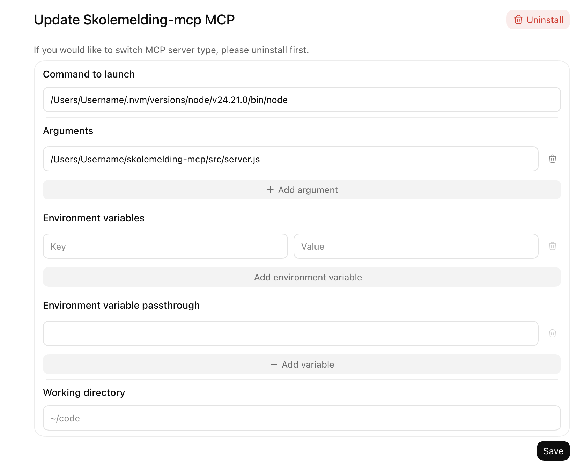

# Skolemelding MCP

Norsk · [English](README.md)

Les meldinger og vedlegg fra Skoleplattform Oslo med en lokal MCP-server. De tre verktøyene viser meldinger, leser en melding og laster ned et vedlegg. De sender ikke svar og markerer ikke meldinger som lest.

Ved enkelte skoler i Osloskolen sendes ikke lenger meldingsinnhold og vedlegg på e-post. Denne MCP-en gjør det enklere å hente dem fra Skolemelding og bruke dem i en agentisk arbeidsflyt. Du er selv ansvarlig for å vurdere om skoleinformasjon skal deles med ChatGPT eller andre skybaserte eller kommersielle KI-tjenester.

**Kun testet på macOS med Google Chrome. Andre plattformer og nettlesere er ikke testet.**

## Installer

Installer Node.js 20 eller nyere og Google Chrome. Åpne prosjektmappen i Terminal og kjør:

```sh
npm install
npm run login
```

Fullfør innloggingen via ID-porten i Chrome. Kjør `npm test` for å kontrollere serveren uten å bruke kontoen din.

## Legg til i ChatGPT-appen

Åpne **Settings → MCP servers → Add server** og velg **STDIO**. Fyll inn:

| Felt | Verdi |
| --- | --- |
| Command to launch | Fullstendig sti til Node.js; finn den med `command -v node` |
| Arguments | Ett argument: fullstendig sti til prosjektets `src/server.js` |
| Working directory | Fullstendig sti til prosjektmappen |
| Environment variables | La stå tomt |

Lagre, start ChatGPT på nytt, og skriv `/mcp` i en samtale for å kontrollere tilkoblingen. Bytt ut eksempelstiene i skjermbildet med dine egne. `~/code` i bildet er bare en plassholder for arbeidsmappen.



[ChatGPT-appen støtter lokale MCP-servere](https://learn.chatgpt.com/docs/extend/mcp). ChatGPT i nettleseren bruker ikke dette lokale oppsettet.

## Personvern og lisens

Innloggingen lagres i `.data/`. Hold mappen privat. Skolemeldinger sendt til en KI-tjeneste i skyen kan forlate datamaskinen. Løsningen bruker udokumenterte Skolemelding-endepunkter som kan endres. Hvis økten utløper, kjør `npm run login` på nytt.

Koden og dokumentasjonen har [0BSD-lisens](LICENSE): alle kan bruke, endre og dele dem gratis til alle formål, også kommersielt, uten krav om kreditering. Lisensen gjelder ikke Skolemelding-tjenesten eller innholdet der.

Ved publisering: bruk Git og kontroller `git status --short` før du lagrer endringene. `.gitignore` utelater lokale innlogginger, research-filer, installerte pakker og ZIP-arkiver. Ikke last opp hele mappen manuelt.
